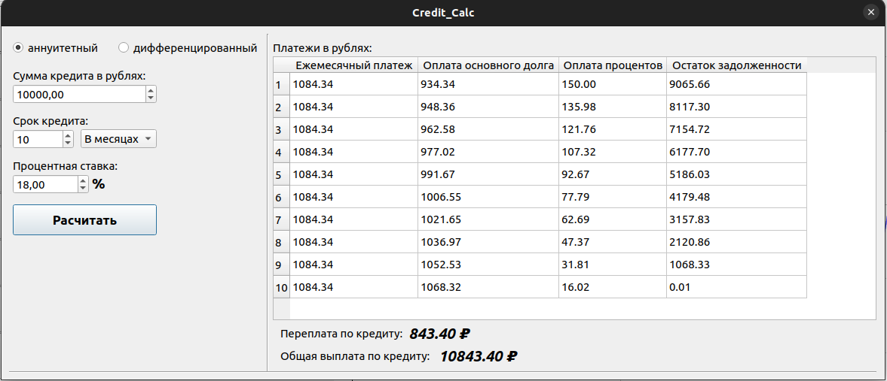

# SmartCalc-v1.0

Реализовать на языке программирования Си с использованием структурного подхода расширенную версию обычного калькулятора, который можно найти в стандартных приложениях каждой операционной системы. Помимо базовых арифметических операций, как плюс-минус и умножить-поделить, Вам необходимо дополнить калькулятор возможностью вычисления арифметических выражений с учетом приоритетов, а так же некоторыми математическими функциями (синус, косинус, логарифм и т.д.). Помимо вычисления выражений калькулятор так же должен поддерживать использование переменной _x_ и построение графика соответствующей функции. В качестве дополнительных улучшений можно будет рассмотреть кредитный и депозитный калькулятор.

## Реализация алгоритма

Пока в исходной строке есть необработанные лексемы, считываем очередную:

Если лексема:
- Число - добавляем в строку вывода.
- Функция или открывающая скобка - помещаем в стек.
- Разделитель аргументов функции (например, запятая):         
    - Перекладываем операторы из стека в выходную очередь пока лексемой на вершине стека не станет открывающая скобка. Если в стеке не окажется открывающей скобки - в выражении допущена ошибка.
- Оператор (O1):
    - Пока присутствует на вершине стека лексема-оператор (O2) чей приоритет выше приоритета O1, либо при равенстве приоритетов O1 является левоассоциативным:
        - Перекладываем O2 из стека в выходную очередь.
    - Помещаем O1 в стек.
- Закрывающая скобка:
    - Пока лексема на вершине стека не станет открывающей скобкой, перекладываем лексемы-операторы из стека в выходную очередь.
    - Удаляем из стека открывающую скобку.
    - Если лексема на вершине стека — функция, перекладываем её в выходную очередь.
    - Если стек закончился до того, как была встречена открывающая скобка - в выражении содержится ошибка.

Если во входной строке больше не осталось лексем:
- Пока есть операторы в стеке:
    - Если на вершине стека скобка - в выражении допущена ошибка.
    - Перекладываем оператор из стека в выходную очередь.

Конец.

## Задача 1. Реализация SmartCalc v1.0

Необходимо реализовать программу SmartCalc v1.0:

- Программа должна быть разработана на языке Си стандарта C11 с использованием компилятора gcc. Допустимо использование дополнительных библиотек и модулей QT
- Код программы должен находиться в папке src 
- Сборка программы должна быть настроена с помощью Makefile со стандартным набором целей для GNU-программ: all, install, uninstall, clean, dvi, dist, test, gcov_report. Установка должна вестись в любой другой произвольный каталог
- Программа должна быть разработана в соответствии с принципами структурного программирования
- При написании кода необходимо придерживаться Google Style
- Должно быть обеспечено покрытие unit-тестами модулей, связанных с вычислением выражений, с помощью библиотеки Check
- Реализация с графическим пользовательским интерфейсом, на базе любой GUI-библиотеки с API для C89/C99/C11 
 Для Linux: GTK+, CEF, Qt
 Для Mac: GTK+, Nuklear, raygui, microui, libagar, libui, IUP, LCUI, CEF, Qt
- На вход программы могут подаваться как целые числа, так и вещественные числа, записанные через точку. По желанию можно обрабатывать ввод чисел в экспоненциальной записи
- Вычисление должно производиться после полного ввода вычисляемого выражения и нажатия на символ `=`
- Вычисление произвольных скобочных арифметических выражений в инфиксной нотации
- Вычисление произвольных скобочных арифметических выражений в инфиксной нотации с подстановкой значения переменной _x_ в виде числа
- Построение графика функции, заданной с помощью выражения в инфиксной нотации с переменной _x_  (с координатными осями, отметкой используемого масштаба и сеткой с адаптивным шагом)
    - Не требуется предоставлять пользователю возможность менять масштаб
- Область определения и область значения функций ограничиваются по крайней мере числами от -1000000 до 1000000
    - Для построения графиков функции необходимо дополнительно указывать отображаемые область определения и область значения
- Проверяемая точность дробной части - минимум 7 знаков после запятой
- У пользователя должна быть возможность ввода до 255 символов
- Скобочные арифметические выражения в инфиксной нотации должны поддерживать следующие арифметические операции и математические функции:
    - **Арифметические операторы**:

        | Название оператора | Инфиксная нотация   (Классическая) | Префиксная нотация   (Польская нотация) |  Постфиксная нотация   (Обратная польская нотация) |
        | ------ | ------ | ------ | ------ |
        | Скобки | (a + b) | (+ a b) | a b + |
        | Сложение | a + b | + a b | a b + |
        | Вычитание | a - b | - a b | a b - |
        | Умножение | a * b | * a b | a b * |
        | Деление | a / b | / a b | a b \ |
        | Возведение в степень | a ^ b | ^ a b | a b ^ |
        | Остаток от деления | a mod b | mod a b | a b mod |
        | Унарный плюс | +a | +a | a+ |
        | Унарный минус | -a | -a | a- |

        >Обратите внимание, что оператор умножения содержит обязательный знак `*`. Обработка выражения с опущенным знаком `*` является необязательной и остается на усмотрение разработчика

    - **Функции**:
  
        | Описание функции | Функция |   
        | ---------------- | ------- |  
        | Вычисляет косинус | cos(x) |   
        | Вычисляет синус | sin(x) |  
        | Вычисляет тангенс | tan(x) |  
        | Вычисляет арккосинус | acos(x) | 
        | Вычисляет арксинус | asin(x) | 
        | Вычисляет арктангенс | atan(x) |
        | Вычисляет квадратный корень | sqrt(x) |
        | Вычисляет натуральный логарифм | ln(x) | 
        | Вычисляет десятичный логарифм | log(x) |

## Задача 2. Кредитный калькулятор

Предусмотреть специальный режим "кредитный калькулятор" (за образец можно взять сайты banki.ru и calcus.ru):
 - Вход: общая сумма кредита, срок, процентная ставка, тип (аннуитетный, дифференцированный)
 - Выход: ежемесячный платеж, переплата по кредиту, общая выплата

## Задача 3. Депозитный калькулятор

Предусмотреть специальный режим "калькулятор доходности вкладов" (за образец можно взять сайты banki.ru и calcus.ru):
 - Вход: сумма вклада, срок размещения, процентная ставка, налоговая ставка, периодичность выплат, капитализация процентов, список пополнений, список частичных снятий
 - Выход: начисленные проценты, сумма налога, сумма на вкладе к концу срока

## Сборка и запуск

Программа разрабатывались и тестировались в ОС **`Ubuntu desktop 22.04`** на С/С++ (+QT)

- `make check` - проверка стилей и cppcheck
- `make test` - запуск тестов
- `make leak_test` - проверка на утечкия
- `make gcov_report` - запуск тестов и генерация отчета. `make open_report` - открывает отчет
- `make clean` - удалить файлы сборки и временные файлы
- `make install` -  собрать приложение. Автоматически откроется каталог `/home/SmartCalc-1.0` в нем будет находиться исполняемый файл программы `s21_smart_calc`
- `make uninstall` -  удаляет приложение из `/home/SmartCalc-1.0`

